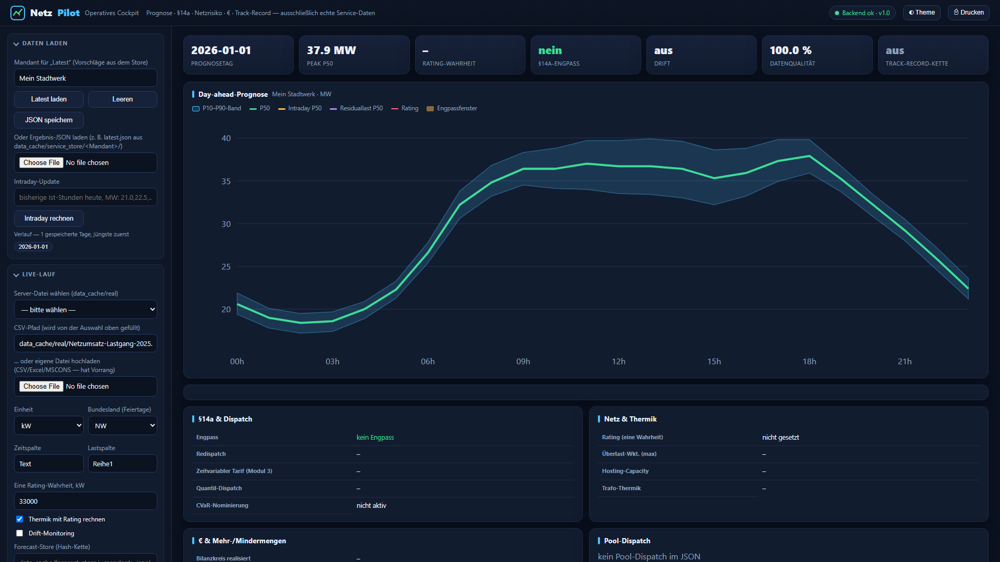

# NetzPilot

<p align="center">
  
</p>

**Leakage-sichere Last-, Erzeugungs- und Residuallastprognose für kleine deutsche Stadtwerke — mit §14a-EnWG-Steuerung, Bilanzkreis-Ökonomie und operativem Cockpit.**

> **Lizenz: GNU AGPL-3.0** (Open Source, Copyleft) — siehe [LICENSE](LICENSE). Eine **kommerzielle Lizenz** ohne AGPL-Pflichten ist auf Anfrage erhältlich, siehe [LICENSING.md](LICENSING.md).

---

## Was ist NetzPilot?

NetzPilot erstellt **Day-ahead- und Mehrtages-Prognosen** (D+1…D+3) für die Netzlast kleiner deutscher Verteilnetzbetreiber — mit kalibrierten Unsicherheitsbändern (P10/P50/P90), streng leakage-sicher (rolling-origin, Pflicht-Baselines) und auf echten DSO-Lastgängen validiert. Darauf aufbauend liefert es die **§14a-EnWG-Steuerkette** (faire Abregelung, Re-Dispatch, zeitvariables Netzentgelt, VPP-Pool), die **Bilanzkreis-Ökonomie** (reBAP/Spot) und ein **bedienbares Cockpit**.

<p align="center">
  
</p>

<p align="center"><sub>Operatives Cockpit der lokal laufenden FastAPI-Instanz mit geladenem Service-Lauf; erreichbar unter <code>/cockpit</code>.</sub></p>

## Kernfunktionen

- **Prognose** — Day-ahead & D+1…D+3 mit kalibrierten P10/P50/P90-Bändern und Intraday-Resttag-Korrektur; leakage-sicher (rolling-origin, Saisonal-Naiv als Pflicht-Baseline).
- **§14a-EnWG-Koordination** — faire, minimale Abregelung (Water-Filling), rollierender Re-Dispatch, zeitvariables Netzentgelt (Modul 3), VPP-Pool.
- **§14a-Compliance** — Monats-Meldebogen (VNBdigital-Pflichtfelder) + Diskriminierungsfreiheits-Nachweis aus einem hash-verketteten Eingriffs-Ledger.
- **Bilanzkreis-Ökonomie** — realisierte reBAP-/Spot-Abrechnung mit Unsicherheitsband statt Plakatzahl.
- **Daten-Eingang** — robuster CSV-/Excel-Loader und MSCONS-Leser (EDIFACT-Lastgang, read-only).
- **Bedienung** — Single-File-Cockpit (`/cockpit`), druckbarer Ergebnisbericht mit Live-Track-Record, täglicher SMARD-Live-Lauf, Blind-Challenge-Sofort-Backtest (~15 s).

## Schnellstart

**Ein Doppelklick — echte Software mit Oberfläche:**

- **Windows:** Doppelklick auf `Start_NetzPilot.bat`
- **macOS/Linux:** `./start_netzpilot.sh`

Der Starter richtet beim ersten Mal automatisch alles ein (virtuelle Umgebung + Pakete), startet das Python-Backend (`netzpilot/service`) und öffnet <http://127.0.0.1:8000/>. Dort einen CSV-Lastgang hochladen → Day-ahead-Prognose mit kalibrierten Bändern + §14a-Fahrplan, gerechnet von der echten Engine. **Voraussetzung:** Python 3.10–3.12.

> Die Dateien `NetzPilot_Tool.html` / `NetzPilot_Cockpit.html` sind nur Offline-Schaufenster ohne Backend.

**Manuell / Entwicklung:**

```powershell
python -m venv .venv
.\.venv\Scripts\activate
pip install -r requirements.txt
python -m pytest -q
```

**Öffentlichen DSO-Datenkorpus lokal aufbauen:**

```powershell
# Bisheriger deutscher Validierungskorpus
python scripts\fetch_dso_corpus.py --set core

# Zusätzliche Last-, Einspeise-, Verlust- und SLP-Reihen aus dem Quellen-Audit
python scripts\fetch_dso_corpus.py --set extended

# Registry nach dem Download validieren/neu erzeugen
python scripts\build_corpus_index.py
```

Die Rohdaten werden unter `data_cache/real/` mit URL, Abrufzeit und SHA-256 im
`download_manifest.json` abgelegt. Der Ordner bleibt bewusst gitignoriert: Die gesetzliche
Veröffentlichung der Daten ist nicht automatisch eine Erlaubnis zur Weiterverteilung.

**Konsolidierter Selbsttest** (alle Unit-/Leakage-/Integrationstests + UI-Harness):

```powershell
python scripts\run_all_checks.py
```

## Ergebnisse (Auszug)

- Öffentliche-Daten-Baseline vom **2. Juli 2026**: **76** nach Werte-Hash deduplizierte
  Benchmark-Reihen, davon **74 von 76** signifikant besser als die naive Vorwochen-Regel;
  medianer Skill **+23,1 %**. Mehrere Jahre und Spannungsebenen desselben Betreibers sind dabei
  ausdrücklich **keine 76 unabhängigen Stadtwerke**.
- **Stadtwerke Hilden Netzumsatz 2025:** MAPE **3,5 %**, Skill **+18,9 %** vs. Saisonal-Naiv.
- **Nationale Last** (2-Jahres-Cache): MAPE **3,36 %**, Skill **+55,8 %** vs. Saisonal-Naiv.
- **§14a-Re-Dispatch** (3 echte DSO-Reihen): im Mittel **74,3 % weniger Abregelenergie** als pauschale Dauerdimmung bei gehaltener Netzgrenze.

➡️ Vollständige öffentliche Zusammenfassung mit Grenzen: **[PUBLIC_DATA_BENCHMARK.md](PUBLIC_DATA_BENCHMARK.md)**.

➡️ Vollständige Entwicklungs-Historie (T2–T44), alle Messwerte, Artefakt-Pfade und Methodik-Details: **[ENTWICKLUNG.md](ENTWICKLUNG.md)**.

## Methodische Grundregeln

Kein Leakage: Wetter im Backtest ist Open-Meteo *Historical Forecast*, nie Reanalyse/Ist-Wetter. Baselines bleiben immer dabei. Rolling-Origin statt k-fold. DST und Feiertage werden berücksichtigt. Schwache Ergebnisse werden dokumentiert statt schöngerechnet.

## Projektstruktur

```text
netzpilot/
  data/       SMARD, Open-Meteo, Residual-/Erzeugungs-/Small-Utility-Daten, reBAP/Spot
  features/   leakage-sichere Features
  models/     Baselines, Ridge, LightGBM-Quantile
  eval/       Metriken, Rolling-Origin, CQR, Economics, Bilanzkreis
  control/    §14a-Steuerkette: Re-Dispatch, Risiko/CVaR, EEBUS-LPC, VPP-Pool
  grid/       Netz-/Asset-Thermik (IEC 60076-7)
  service/    FastAPI-Backend, Cockpit, Drift-Monitor, Tarif, Dispatch
  report/     HTML-/Markdown-Bericht
scripts/              reproduzierbare Läufe
tests/                Unit-/Leakage-/Integritätstests
prognose_engine_v1/   eingefrorenes v1-Beispiel (mit Beispieldaten für die Tests)
```

## Lizenz

NetzPilot steht unter der **GNU AGPL-3.0** (siehe [LICENSE](LICENSE)): du darfst es nutzen, studieren, ändern und weitergeben, musst abgeleitete Werke (auch als Netzwerk-/SaaS-Dienst, AGPL § 13) aber ebenfalls unter der AGPL-3.0 offenlegen. Für eine Nutzung **ohne** AGPL-Pflichten gibt es eine **kommerzielle Zweitlizenz** — Details in [LICENSING.md](LICENSING.md). © 2026 Amar Akram.
